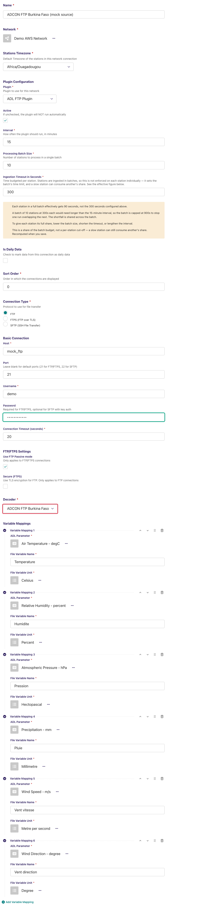
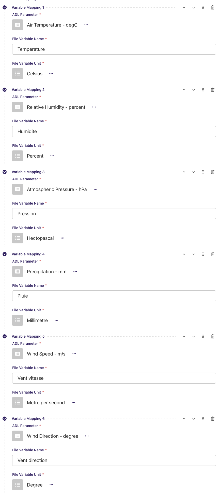
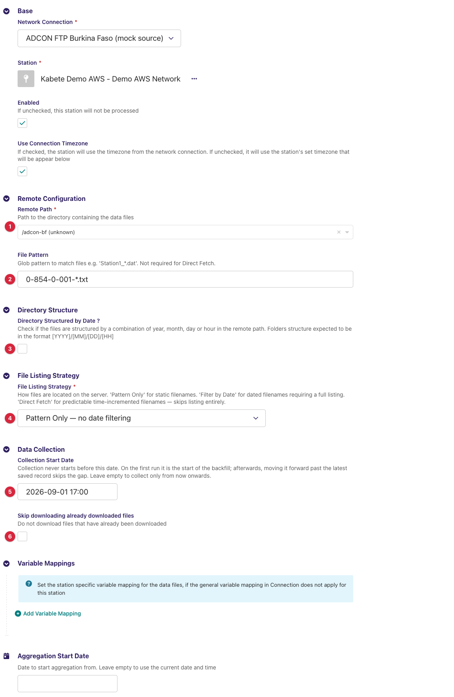
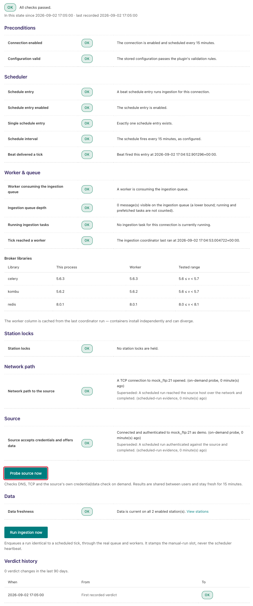
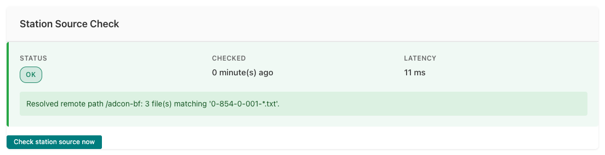
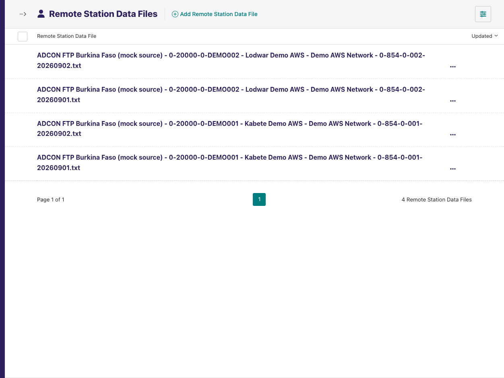

# ADL ADCON FTP Burkina Faso Plugin

Adds a **decoder** to the [ADL FTP Plugin](https://github.com/wmo-raf/adl-ftp-plugin)
for the daily observation export files that the **ADCON addVANTAGE** server of
Burkina Faso's ANAM pushes to an FTP server: one tab-separated file per station
and day, French decimal commas, a station code column and split date/time
columns. With this plugin installed, an ADL FTP/SFTP connection can select
**ADCON FTP Burkina Faso** as its decoder and collect those files like any
other FTP source.

**Repository:** [adl-ftp-adcon-bf-plugin](https://github.com/anam-bf/adl-ftp-adcon-bf-plugin)
**Plugin type identifier:** `adl_ftp_adcon_bf_plugin` (registry entry only — see below)
**Decoder identifier:** `adcon_bf` · **Decoder display name:** *ADCON FTP Burkina Faso*
**Connection model:** none of its own — uses the FTP plugin's `NetworkFTP` · **Station link model:** the FTP plugin's `FTPStationLink`

> **About the screenshots.** Every image in this guide is regenerated from
> `docs/screenshots.yml` against a seeded demo instance, so hostnames, station
> names, ids and readings in them are placeholders — not values to copy. The
> field tables are the reference for what to enter.

## Overview

This is a *decoder plugin*: it defines no connection or station link of its
own and never talks to a server. The FTP plugin does the listing and
downloading; this plugin turns each downloaded file into observation records.

```
addVANTAGE export ──▶ FTP server ──▶ ADL FTP Plugin (list, match, download)
                                          │
                                          ▼
                              ADCON FTP Burkina Faso decoder (this plugin)
                                          │
                                          ▼
                       records ──▶ variable mappings ──▶ ADL observations
```

Although the plugin registers itself in the ADL plugin registry (as every
plugin package must), **you never choose it as a connection's plugin**. The
connection's plugin is *ADL FTP Plugin*; this plugin appears only as an entry
in that connection's **Decoder** list. Everything about hosts, credentials,
paths, listing strategies, downloads and the monitoring screens is documented
in the [ADL FTP Plugin guide](https://github.com/wmo-raf/adl-ftp-plugin/blob/main/docs/guide.md);
this guide covers what is specific to the Burkina Faso files.

## Prerequisites

- A running ADL instance with the **ADL FTP Plugin** installed (this plugin
  imports from it and cannot load without it).
- FTP/SFTP access to the server the addVANTAGE export writes to — host, port,
  account, and the directory holding the files (see the FTP plugin guide's
  prerequisites for the network side).
- Files in the expected layout (next section). If the export format on the
  addVANTAGE side changes, the decoder must change with it.

## Installation

Installed like any ADL plugin — see the core *Plugin Installation* page for all
methods. Both entries are needed in `plugins.toml`, the FTP plugin first:

```toml
[[plugins]]
name = "ADL FTP Plugin"
git  = "https://github.com/wmo-raf/adl-ftp-plugin.git"
tag  = "0.13.0"

[[plugins]]
name = "ADL ADCON FTP Burkina Faso Plugin"
git  = "https://github.com/anam-bf/adl-ftp-adcon-bf-plugin.git"
tag  = "0.1.2"
```

After rebuild/restart, confirm both appear in `docker compose exec adl
list-plugins`, and that *ADCON FTP Burkina Faso* is offered in the Decoder
list of a new FTP connection. Use **0.1.2 or later**: earlier releases do
not run on FTP plugin 0.10.0 or later (see Compatibility).

## The file format this decoder reads

| Aspect | Expected |
|---|---|
| File name | `<station code>-<YYYYMMDD>.txt`, e.g. `0-854-0-004-20250216.txt` — the station's WIGOS-style code, a hyphen, and the day the file covers. The decoder finds the date **anywhere in the name**, so the code may contain hyphens. |
| Encoding / separators | Text, **tab**-separated columns, **comma** as the decimal separator (`23,4`). |
| Header row | The first line names the columns. Three are fixed: `Code station`, `Date`, `Heure`. Every other column is a measured variable, and its header is what you enter as *File Variable Name* in the variable mappings. |
| `Date` column | The day written as **`YYYYDDMM`** — year, then **day, then month**: 16 February 2025 is `20251602`. Note the asymmetry with the file name, which uses the usual `YYYYMMDD` (`20250216`) — both are exactly what the export produces, and the decoder parses each in its own order. This is intentional; do not "correct" one to match the other. |
| `Heure` column | Time of day as `HHMM` (e.g. `0930`). |
| Values | Numeric; a cell that is not a number (including the export's empty/`---` markers) is stored as missing for that variable and row. |
| Observation time | `Date` + `Heure`, read as the station's local time (the connection's *Stations Timezone*, or the station link's own). |

## Connection configuration

Create a **Network FTP/SFTP** connection exactly as the FTP plugin guide
describes (connection type, host, port, username, password, passive mode,
timeout), then:

| Field | Value for this source |
|---|---|
| Decoder | **ADCON FTP Burkina Faso** |
| CSV Configuration | Leave empty — this decoder needs no configuration. |
| Variable Mappings | One row per column to store (below). Connection-level mappings apply to every station on the connection, which suits this source since all stations share the same export layout. |



### Variable mappings

| Field | Description |
|---|---|
| ADL Parameter | The ADL `DataParameter` the values are stored under. |
| File Variable Name | The column header **exactly** as it appears in the file, including spaces and accents. |
| File Variable Unit | The unit the addVANTAGE export writes that column in; ADL converts from it to the ADL parameter's unit. Check the sensor's unit in addVANTAGE. |



**Example (illustrative headers — use the ones in your files):** ADL Parameter
`Air Temperature` ← File Variable Name `Temperature`, unit `degC`.

The FTP plugin's **Test Decoder Configuration** action on the connection row
(see its guide) decodes one uploaded file with this decoder and shows the
records — the quickest way to read the headers off a real file before typing
the mappings.

## Station link configuration

Create an **FTP/SFTP Station Link** per station (all fields are the FTP
plugin's; only the values matter here):

| Field | Value for this source |
|---|---|
| Remote Path | The directory the export writes into. |
| File Pattern | `<station code>-*.txt`, e.g. `0-854-0-004-*.txt` — one station's files. |
| Directory Structured by Date | Off, unless the export nests directories by year/month/day on your server. |
| Date Granularity | Leave it alone. The field only appears when *Directory Structured by Date* is on, so in the configuration above you never see it — and an empty granularity is exactly what this decoder wants: it falls back to **day** and builds one date per day from the start date to today. |
| File Listing Strategy | **Pattern Only**. The date narrowing is done by this decoder, not by the FTP plugin's *Filter by Date* strategy; *Direct Fetch* does not apply. |
| Collection Start Date | The earliest day whose file should be considered. **With no start date, only today's file is looked at** — set it for any backfill. |
| Skip downloading already downloaded files | Because a day's file grows through the day, a file downloaded once at 10:00 is not fetched again at 10:15 while this is on. Turn it **off** on this source so the current day's file is re-downloaded each run (already-saved rows are not duplicated). |



## Admin UI added by this plugin

None. This plugin adds no page, menu entry, button or form of its own; the
only place it appears is as an option in the FTP connection's *Decoder*
select. The FTP plugin's own surfaces — *Test Decoder Configuration*, the
*Direct Fetch Files* preview, the *FTP station data files* list — work with
this decoder and are documented in the FTP plugin guide.

## Data collection behavior

One run, per enabled station link:

1. The FTP plugin lists *Remote Path* and keeps the names matching *File
   Pattern*.
2. This decoder narrows them to files whose name contains one of the dates
   from *Collection Start Date* (or today, if empty) up to today, at the
   station link's *Date Granularity* (`YYYYMMDD` strings).
3. The FTP plugin downloads each file not yet held (or every file, with
   *Skip downloading already downloaded files* off) and hands it to the
   decoder.
4. The decoder reads the file, converts each non-fixed column to a number,
   builds the observation time from `Date` + `Heure`, and yields one record
   per row.
5. ADL applies the variable mappings and unit conversion and stores the
   values. Every decoded row is saved unless it is older than *Collection
   Start Date* (the run's window shapes what is fetched, not what is kept);
   rows already stored are updated, not duplicated.

- **Timezones:** file times are local station time; the station's timezone
  (connection default or per-link) is what ADL stamps them with.
- **Backfill:** set *Collection Start Date* before the first run; every day
  file from that date is fetched.

## Source checks / diagnostics

All monitoring for a connection using this decoder is the FTP plugin's: the
**Ingestion Diagnostic** page proves the FTP host, port and account, and the
station link's **Station Source Check** proves the resolved remote path and
counts the files matching the pattern. Their messages are catalogued in the
FTP plugin guide. This plugin adds no check of its own — a file that lists
and downloads fine but does not decode shows up as a **run failure or a
warning in the activity log**, not in the source checks.





The FTP plugin's **FTP station data files** list (Snippets → FTP station data
files) shows every file fetched for a station link with its *processed* time
and *values saved* count — the first place to look when a file arrived but
nothing was stored.



### Feedback catalogue — messages involving this decoder

These appear in the station's activity log message or the run's task log
(Monitoring → the connection's activity):

| Message (example) | Where | Meaning | What to do |
|---|---|---|---|
| `TypeError: AdconBFDecoder.get_matching_files() takes 3 positional arguments but 5 were given` | run failure, every station | This plugin is at 0.1.1 or earlier on an FTP plugin of 0.10.0 or later, which calls decoders with a date window those releases do not accept. | Upgrade this plugin to 0.1.2 or later; there is no configuration workaround. |
| `Error decoding file 0-854-0-004-20250216.txt: 'Date'` (or `'Heure'`, `'Code station'`) | task log | The file has no column of that name — a different export layout or a non-tab separator. | Open the file: headers must be tab-separated and include `Code station`, `Date`, `Heure`. |
| `Error decoding file …: time data '2025021609:30' does not match format '%Y%d%m%H%M'` | task log | `Date`/`Heure` are not in `YYYYDDMM` / `HHMM` form. | Check the export's date format; the decoder expects year-day-month. |
| `File 0-854-0-004-20250216.txt decoded 144 record(s) but none of its values were saved — check the variable mappings and the ingestion window` | task log (warning) | The file parsed, but no mapped *File Variable Name* matched a column, or every row lies outside the run's window. | Compare the mapping names with the file's headers character for character; check *Collection Start Date*. |
| `No files found for station … matching pattern '0-854-0-004-*.txt' in path /export` | task log (debug) | The listing had no name matching the pattern **and** the decoder's date list. | Check the pattern, the start date and that today's file exists on the server. |
| `Resolved remote path /export: 0 file(s) matching '0-854-0-004-*.txt'.` | Station Source Check (OK) | The FTP plugin's station check: path found, nothing matches right now. | Fine at day start before the first export; otherwise check the pattern. |

## Troubleshooting

**Every station fails immediately with a `TypeError` about `get_matching_files`**
: The installed plugin is 0.1.1 or earlier, which predates the FTP plugin's
  dated decoder API (FTP plugin 0.10.0). Upgrade to 0.1.2 or later; nothing
  in the configuration fixes it.

**Files are listed and downloaded, but *values saved* is 0**
: Headers and *File Variable Name* differ (accents, double spaces, trailing
  spaces), or the unit/parameter mapping is missing. Use *Test Decoder
  Configuration* on the connection to see the record keys the decoder emits.

**Only today's file is ever collected**
: *Collection Start Date* is empty. The decoder's date list starts at the
  start date, or today when there is none.

**Today's file stops growing in ADL after the first fetch**
: *Skip downloading already downloaded files* is on. Turn it off for this
  source (see Station link configuration).

**Dates look swapped (month and day)**
: The export writes `YYYYDDMM` and the decoder expects exactly that. A file
  written in `YYYYMMDD` decodes wrongly or fails for days > 12.

## Compatibility

| Plugin version | Requires | Notes |
|---|---|---|
| 0.1.2 | ADL FTP Plugin >= 0.10.0 (written against 0.13.0), ADL core 0.8.x | Current release. Accepts the FTP plugin's dated decoder API. |
| 0.1.1 and earlier | ADL FTP Plugin < 0.10.0 | Do not use on a current stack: the FTP plugin has passed a date window to `get_matching_files()` since 0.10.0, and these releases override the old two-argument form, so every run fails with a `TypeError` before any file is downloaded (issue #5, fixed in 0.1.2). |

## Changelog

See [GitHub Releases](https://github.com/anam-bf/adl-ftp-adcon-bf-plugin/releases).
